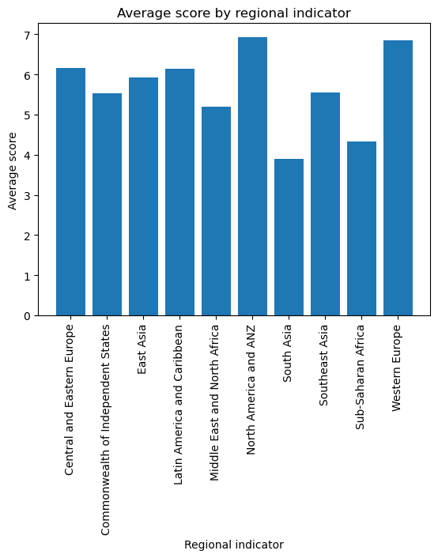
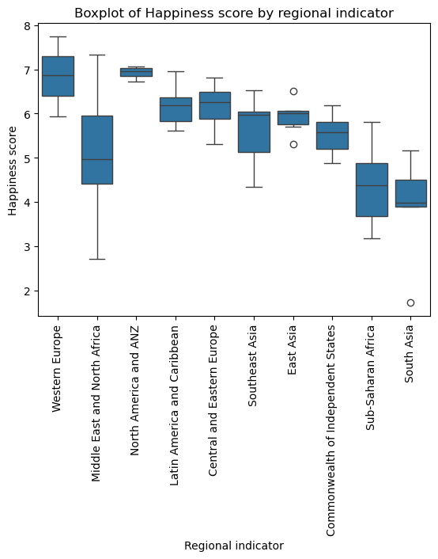
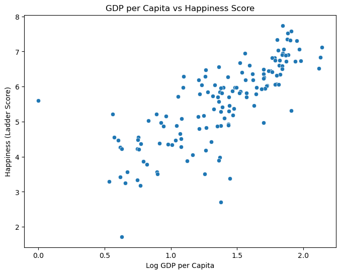

Here’s a filled-out version of your **README** with descriptive content for each section and image:

---

# World Happiness Analysis

This project analyzes the **World Happiness dataset** to explore factors influencing happiness scores across countries. It involves **data cleaning, exploratory data analysis (EDA), statistical analysis, mathematical modeling, feature engineering, and SQL-like queries using Pandas**.

---

## Part 2 – EDA (Exploratory Data Analysis)

In this stage, we explore the dataset to understand patterns, correlations, and distributions of happiness-related variables such as GDP per capita, social support, life expectancy, freedom, generosity, and perceptions of corruption.

**Image 1:** World Happiness Score distribution across countries.

**Image 2:** Correlation heatmap showing relationships between key happiness factors.

**Image 3:** GDP per capita vs. Happiness Score scatter plot.

**Image 4:** Regional comparison of average happiness scores using bar plots.

---

## Part 3 – Statistics

Statistical measures such as **mean, median, mode, variance, and standard deviation** are calculated for numerical columns. Hypothesis testing and correlation analysis help identify the most influential factors on happiness.

---

## Part 4 – Linear Algebra

Matrix operations are applied to model relationships between variables, using techniques like **matrix multiplication and transformations** to analyze multivariate relationships in the dataset.

---

## Part 5 – Calculus

Basic calculus concepts, such as **derivatives and gradients**, are used to understand changes in happiness scores with respect to key variables, aiding in optimization and predictive modeling.

---

## Part 6 – Feature Engineering

New features are created, such as **Happiness-to-GDP ratio** and **Adjusted Happiness Score** considering corruption and generosity factors. Missing values are handled, and categorical variables are encoded for further analysis.

---

## Part 7 – SQL Simulation in Pandas

Using Pandas, SQL-like queries are simulated to perform **grouping, filtering, sorting, and aggregation**. This allows quick extraction of insights from the dataset without using an actual database.

---

## Insights

From the analysis, we find:

* GDP per capita and social support have the strongest correlation with happiness scores.
* Regions with high life expectancy generally report higher happiness.
* Corruption perception negatively impacts happiness.

**Image 5:** Final insights visualized in a comparative chart.
*Image: (world\_happiness\_outputs/output\_5.png)*

**Image 6:** Prediction results or ranking visualization of happiest countries.
*Image: (world\_happiness\_outputs/output\_6.png)*

---

If you want, I can now **generate this as a clean README.md file with the images embedded** so it looks visually appealing on GitHub. Would you like me to do that?
